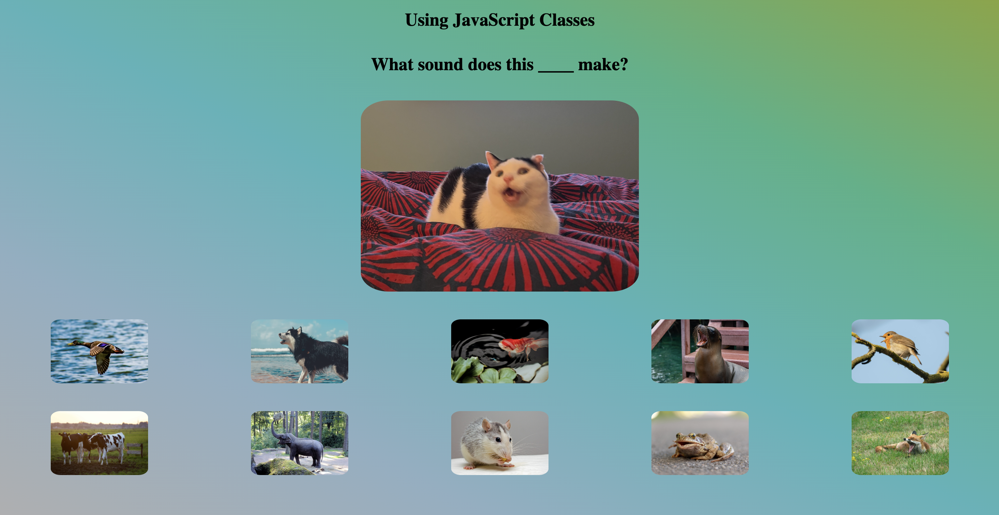

# 

## Setup

Open your Terminal application and navigate to your `~/code/ga/lectures` directory:

```bash
cd ~/code/ga/lectures
```

Fork the [playing-audio-in-the-browser-starter-code](https://git.generalassemb.ly/modular-curriculum-all-courses/playing-audio-in-the-browser-starter-code) repository.

Clone a copy of your remote repo locally by using the `git clone` command:

```bash
git clone https://git.generalassemb.ly/<your-username>/playing-audio-in-the-browser-starter-code.git
```

> 📚 Note: In the link above, where it says `<your-username>`, you should see the username from your GitHub account.

Next, `cd` into your new cloned directory, `playing-audio-in-the-browser-starter-code`:

```bash
cd playing-audio-in-the-browser-starter-code
```

Open the project's folder in your code editor:

```bash
code .
```

Open your `index.html` file in the browser. You should see something like this:

